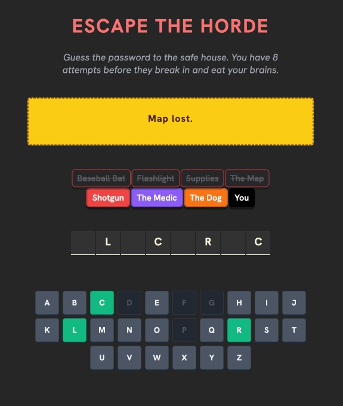

# Escape the Horde 🧟‍♂️

A "high-stakes" word guessing game built with React.

*(yet to make it live)*



## 🤔 What is this?
Basically, it's Hangman, but with emotional damage.

Instead of drawing a stick figure, you start with a set of valuable survival items (Flashlight, Map, Medic, etc.). Every time you guess the wrong letter, you lose an item. Please don't let **The Dog** die.

## ⚙️ How it works
* **The Engine:** React + Vite (fast, they say).
* **Styling:** Plain CSS with a bit of `clsx` for conditional classes. No Tailwind 
* **The Logic:**
    * Selects a random word from a list.
    * Tracks your guessed letters and compares them to the target.
    * If you win, you get a "Survivor" badge.
    * If you lose, you get EATEN by zombies.

## 🛠️ Tech Stack
* **React** (Functional components, Hooks)
* **Vite** (Build tool)
* **JavaScript** (ES6+)
* **CSS** (Grid, Flexbox, and some 3D transforms for the chips)
* **clsx** (For toggling classes without making the code look like spaghetti)

## 🚀 How to run it locally
If you want to poke around the code or fix my bugs:

1.  **Clone the repo:**
    ```bash
    git clone https://github.com/nogitankit/escape-the-horde.git
    ```
2.  **Install dependencies:**
    ```bash
    cd escape-the-horde
    npm install
    ```
3.  **Run the dev server:**
    ```bash
    npm run dev
    ```
4.  Open `localhost:5173` and try to save the dog.

## 🧠 Things I Learned
* **State Management:** Passing props between siblings is impossible, so I learned to lift state up to the parent.
* **The `useEffect` Trap:** I accidentally created an infinite loop that crashed my browser 3 times. Let's not talk about that.
* **Responsiveness:** Made the keyboard wrap correctly on mobile so the "Z" key doesn't fly off the screen.

## 🔮 Future Improvements
(I feel like the game is almost done, but here are some stuffs that i'll add if I feel like it):
* [ ] Add a difficulty setting (Easy/Hard mode).
* [ ] Fetch words from an actual API instead of a hardcoded array.
* [ ] Add sound effects (zombie groans, shotgun blasts).
* [ ] Dark mode toggle (wait, it's alr dark lol).

## 🤝 Contributing
Feel free to fork this! If you find a bug, please fix it and don't judge my code. I'm still learning.

---
*Made with 💻 and ☕ by Ankit Sharma*
